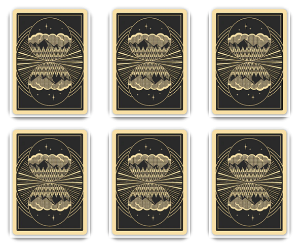
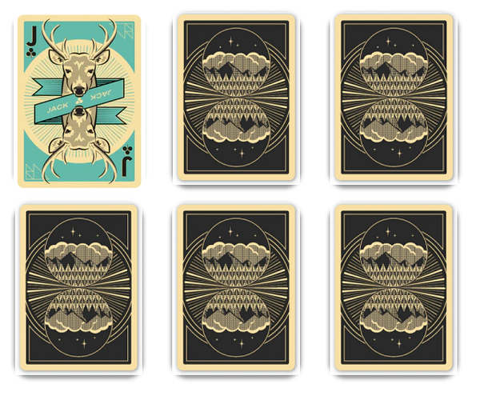
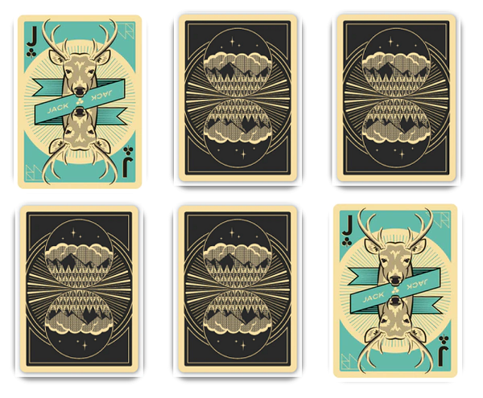
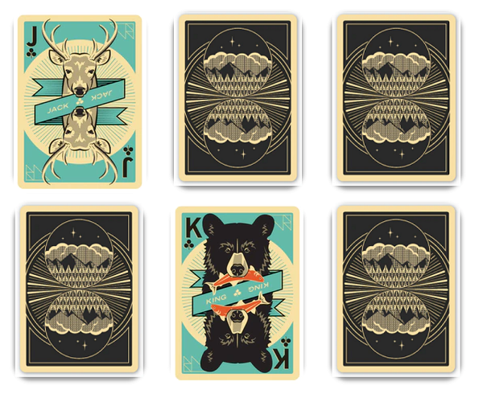
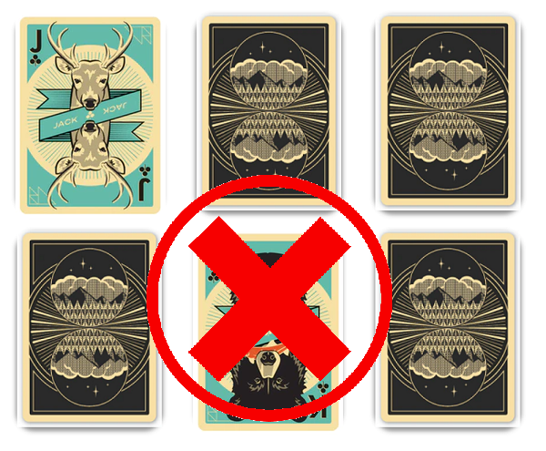

# clicky



Welcome to clicky, the world's most cutting edge card-match game made using React.

On the game screen the user is presented with 6 cards flipped over so you cannot tell what it is

# Logic

The game uses a setState array to save the name of each card (assigned in the card component) after the user's first and second clicks. Then it checks if the two items in the array match, scores accordingly, and clears the state for the next clicks.

```
winCheck = () => {
    if (this.state.cardPicked[0] == this.state.cardPicked[1]) {
      let newScore = (this.state.score + 1);
      this.setState({ score: newScore })
      alert("You got a point!")
      this.setState({ cardPicked: [] })

    }
    else {
      let newStrikes = (this.state.strikes + 1);
      this.setState({ strikes: newStrikes })
      alert("That was incorrect.")
      this.setState({ cardPicked: [] })
    }
  }
```

# Match!



Here the user has clicked the top left card, which is a Jack. They click the next card, which is a matching Jack and earn a point!



# Strike!




In this scenario, the user has clicked the Jack again but unfortunately clicks a King next. The game will give them a strike, after three they lose!

